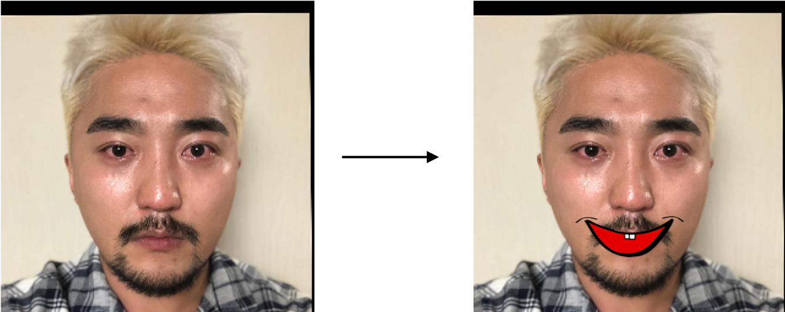
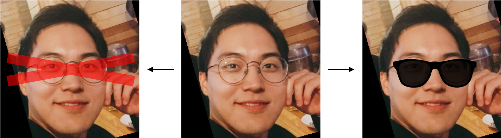
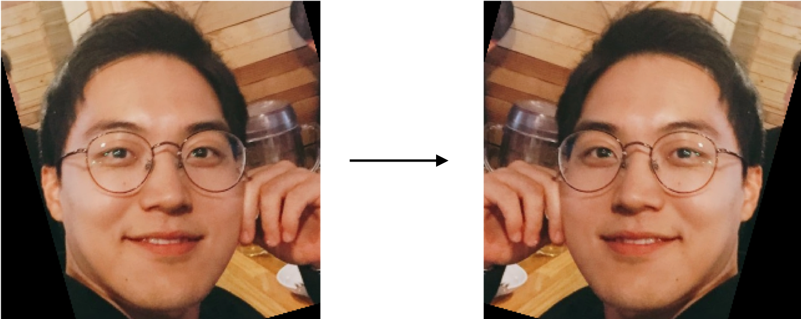
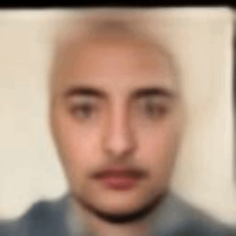
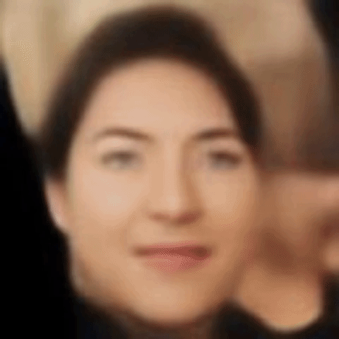
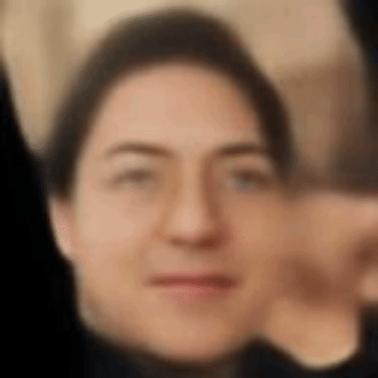

# Deepest Challenge - Face Manipulation

## 1. Objective
아래 세가지 얼굴 변환을 가장 자연스럽게 한 팀이 우승을 차지합니다.

각 팀만의 접근 방식과 이미지 변환 결과를 제출하면, 투표를 통해 우승이 결정됩니다.

가능하면 이미지 변환 결과를 GIF 혹은 이미지 그리드(한 이미지 파일에 여러 이미지)로 제출해주세요.

- 유병재를 웃겨라
  - 주어진 유병재 사진을 웃게 바꾸세요

  

 

- 출제자 안경 지우기/씌우기
  - 주어진 출제자 사진에서 안경이 지워지게/씌워지게 하세요

  

 

- 출제자 좌우 interpolation
  - 주어진 출제자 사진을 좌우 대칭하여 옮겨보세요

  

 

## 2. Background
### 2.1. Datasets
- [CelebA](http://mmlab.ie.cuhk.edu.hk/projects/CelebA.html)
  - 40가지 Attributes가 labelling 되어있는 Celebrity 이미지들
    - Smiling, Eyeglasses 등등
  - 약 20만 개 이미지
  - 눈과 코를 이미지 중앙으로 모은 Align&Cropped Set이 주로 사용됨
    - 128x128, 64x64 등 여러 논문에서 다양하게 resize 하여 사용
- [CelebA-HQ](https://arxiv.org/abs/1710.10196)
  - CelebA에서 질좋은 데이터를 모아 고화질로 바꾼 데이터셋
    - 해상도 1024x1024의 RGB 이미지
  - 약 3만개 이미지
  - 모두 Align & Cropped Set
 
CelebA 데이터셋의 경우는 https://www.kaggle.com/jessicali9530/celeba-dataset 에서 받을 수 있습니다.

CelebA-HQ의 경우는 https://github.com/tkarras/progressive_growing_of_gans 에서 TF Record 형식으로 받을 수 있습니다.

이번 Challenge에서는 CelebA-HQ의 128x128 해상도 이미지를 (pickle로 저장한) numpy 형식으로 제공합니다.

### 2.2. Models
- [VAEs](https://jaan.io/what-is-variational-autoencoder-vae-tutorial/)
  - Encoder - Latent variables - Decoder 구조
  - Latent variables의 분포는 KL divergence를 줄이면서 학습
  - 고화질 이미지 만드는 데에 어려움
- [Flow-based Generative Models](https://blog.evjang.com/2018/01/nf2.html)
  - Encoder와 Decoder는 서로 역함수
  - 이미지의 분포는 likelihood를 높이면서 학습
  - 모든 레이어가 역변환이 가능해야해서 모델을 만들고 학습시키기 굉장히 까다로움
- [Image Translation Models](https://www.microsoft.com/developerblog/2017/06/12/learning-image-image-translation-cyclegans)
  - Encoder - Decoder 구조로 한 도메인에서 다른 도메인으로 이미지를 변형
  - Adversarial Training을 통해 학습
  - Interpolation을 학습하지는 않음

## 3. Tools
간단한 VAE 모델과 이미지 조작에 관련한 코드 및 데이터 셋을 제공합니다.

#### 베이스라인 kit: https://bitbucket.org/jaywalnut310/deepest-face-manipulation-challenge 
- forked from https://github.com/bhpfelix/Variational-Autoencoder-PyTorch 

#### 필요한 데이터: https://drive.google.com/drive/folders/1z0d5dIl23iitXfA9_8HNpw_-x0q7PfH4?usp=sharing
- Pretrained Model
  - [bhpfelix의 pytorch VAE pretrain 모델](https://github.com/bhpfelix/Variational-Autoencoder-PyTorch)을 그대로 사용
  - 다운로드 후 models 폴더에 둘 것
  - 링크: [finalepoch_28_Train_loss_25425.9503_Test_loss_25172.4120.pth](https://drive.google.com/drive/folders/1z0d5dIl23iitXfA9_8HNpw_-x0q7PfH4?usp=sharing)
- Face Manipulation
  - save_attributes
    - CelebA-HQ 128x128을 이용해 attribute vectors 생성
    - 미리 CelebA-HQ 128x128 을 다운로드할 것
  - manipulate_attr
    - 이미지에 attribute vector를 더하며 interpoloation
    - 미리 save_attributes 를 실행할 것
    - attribute 순서는 CelebA 데이터셋의 list_attr_celeba.csv 에 있는 순서와 동일
  - interpolate_lr
    - 이미지를 좌우 반전하여 interpolation
  - [vanila_vae.py](./src/vanila_vae.py) 안에 있음
- Image Alignment & Cropping & Resizing
  - 테스트 전 이미지를 Align & Cropping & Resizing 함
  - [align.py](./src/align.py)
  - landmark predictor가 먼저 필요함
    - 다운로드 후 data 폴더에 둘 것
    - 링크: [shape_predictor_68_face_landmarks.dat](https://drive.google.com/drive/folders/1z0d5dIl23iitXfA9_8HNpw_-x0q7PfH4?usp=sharing)
- Dataset
  - CelebA-HQ의 128x128 해상도 이미지
  - pickle로 저장
  - numpy 형식
  - 다운로드 후 data 폴더에 둘 것
  - 링크: [hq_train.pkl, hq_validation.pkl](https://drive.google.com/drive/folders/1z0d5dIl23iitXfA9_8HNpw_-x0q7PfH4?usp=sharing)
- 테스트 사진
  - Alignment & Cropping & Resizing 하기 전 이미지 파일
  - 다운로드 후 imgs 폴더에 둘 것
  -  링크: [ybj.jpg, kjh.png](https://drive.google.com/drive/folders/1z0d5dIl23iitXfA9_8HNpw_-x0q7PfH4?usp=sharing)

베이스라인 결과는 다음과 같습니다.

  
  
  

 

## 4. Tips &  Cautions & Discussions
- Align & Cropped 이미지 셋이 학습에 매우 유리합니다.
  - 이미지 중앙 부근에 얼굴의 중심이 고정되어 있기때문에 학습하기 쉬움
  - 그러나 테스트할 때 역시 이미지를 Align & Crop 해주어야 함
- CelebA로 학습하기 보다 CelebA-HQ의 해상도를 줄여서 학습하는 것이 편리할 수 있습니다.
  - 질이 좋고 데이터 개수도 적어 학습을 확인하는 데에 시간이 오래걸리지 않음
- VAE와 Flow-based Model은 Unsupervised learning을 하는데, 라벨 데이터를 사용할 수 있다면 더 좋은 결과를 낼 수도 있지 않을까요?

